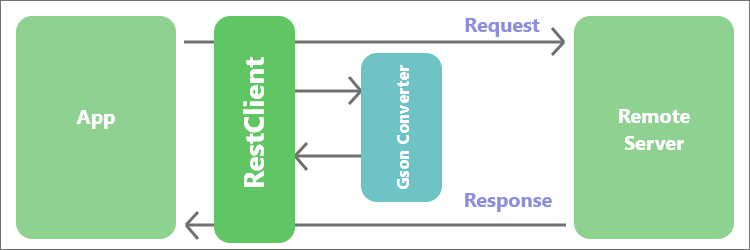
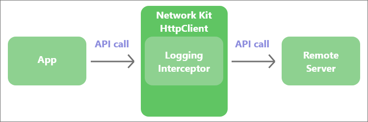
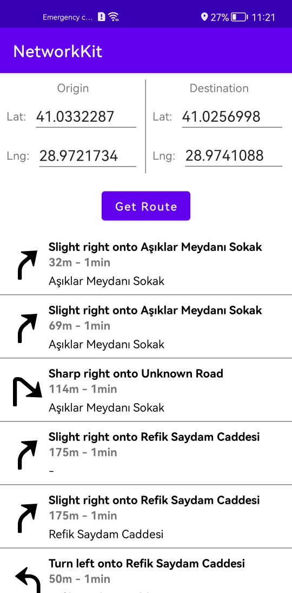
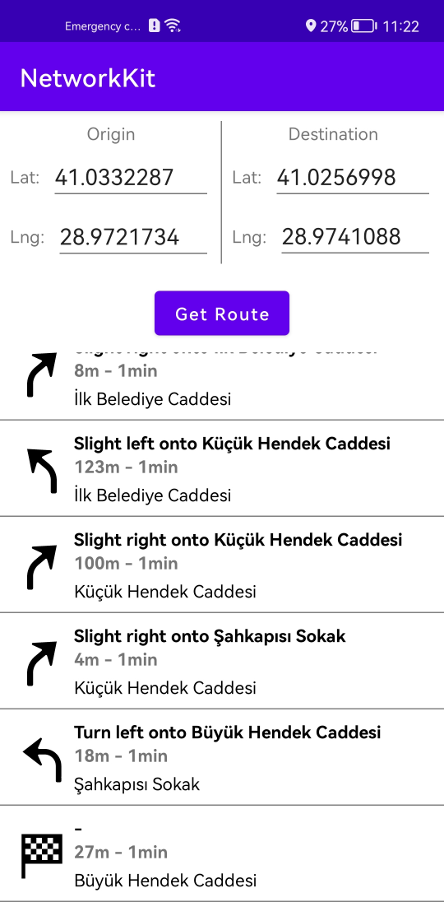

# Network Kit Support Libraries

   

The Network Kit Support Libraries consist of two projects: Network Kit Gson Converter and Network Kit Logging Interceptor.
The project directory is as follows:

|-- [Network Kit Gson Converter](https://github.com/Explore-In-HMS/networkkit/converter-gson)
|-- [Network Kit Logging Interceptor](https://github.com/Explore-In-HMS/networkkit/logging-interceptor)

Also, you can find a demo project which uses both of them.

# Network Kit Gson Converter
In Android, when developers want to send objects as JSON in the HTTP request body, they need to convert them using a converter. Developers mostly use the Gson library to convert Java/Kotlin Objects into their JSON representation. `Network Kit Gson Converter` Library is a ready-to-use converter library that serves as a bridge between the Gson and Network Kit. The library provides the transformation for us. For details, please refer to [Network Kit Gson Converter](https://github.com/Explore-In-HMS/networkkit/converter-gson).


 


# Network Kit Logging Interceptor
You have probably loaded some data from a remote server if you have created an Android app. While developing your app, you frequently need to see what data you are getting from the remote server to your app. `Network Kit Logging Interceptor` is an interceptor that lets you log all the API requests made by your app as well as the responses returned by the server. For details, please refer to [Network Kit Logging Interceptor](https://github.com/Explore-In-HMS/networkkit/logging-interceptor).


 


# Demo App
The Network Kit Demo app shows the driving routes between the departure place and destination based on their coordinates. The app uses the Network Kit use make network operations and the Huawei Map Kit Directions API to get routes.

## About Huawei Network Kit

Network Kit is a basic network service suite. It incorporates Huawei's experience in far-field network communications, and utilizes scenario-based RESTful APIs as well as file upload and download APIs. Therefore, Network Kit can provide you with easy-to-use device-cloud transmission channels featuring low latency, high throughput, and high security.

For more information -> [Huawei Network Kit Guide](https://developer.huawei.com/consumer/en/doc/development/system-Guides/network-introduction-0000001050440045)

## About Huawei Map Kit Directions API

Directions API provides a set of HTTPS-based APIs used to plan routes for walking, cycling, and driving, and calculate route distances. The APIs return route data in JSON format and support planning of the routes between two points.

For more information -> [Huawei Map Kit Direction API Guide](https://developer.huawei.com/consumer/en/doc/development/HMSCore-Guides/web-diretions-api-introduction-0000001050178120)


## What You Will Need

**Hardware Requirements**
- A computer that can run Android Studio.
- Huawei mobile device with a USB data cable for running developed apps

**Software Requirements**
- Java JDK 1.8 or later
- Android Studio 2021.2.x
- Android SDK package
- Android API Level 23 or higher
- HMS Core (APK) 5.2.0.300 or later
- EMUI 8.0 or later

## Getting Started

Network Kit Demo app uses HUAWEI services. To use them, you have to [create an app](https://developer.huawei.com/consumer/en/doc/distribution/app/agc-create_app) first. Before getting started, please [sign-up](https://id1.cloud.huawei.com/CAS/portal/userRegister/regbyemail.html?service=https%3A%2F%2Foauth-login1.cloud.huawei.com%2Foauth2%2Fv2%2Flogin%3Faccess_type%3Doffline%26client_id%3D6099200%26display%3Dpage%26flowID%3D6d751ab7-28c0-403c-a7a8-6fc07681a45d%26h%3D1603370512.3540%26lang%3Den-us%26redirect_uri%3Dhttps%253A%252F%252Fdeveloper.huawei.com%252Fconsumer%252Fen%252Flogin%252Fhtml%252FhandleLogin.html%26response_type%3Dcode%26scope%3Dopenid%2Bhttps%253A%252F%252Fwww.huawei.com%252Fauth%252Faccount%252Fcountry%2Bhttps%253A%252F%252Fwww.huawei.com%252Fauth%252Faccount%252Fbase.profile%26v%3D9f7b3af3ae56ae58c5cb23a5c1ff5af7d91720cea9a897be58cff23593e8c1ed&loginUrl=https%3A%2F%2Fid1.cloud.huawei.com%3A443%2FCAS%2Fportal%2FloginAuth.html&clientID=6099200&lang=en-us&display=page&loginChannel=89000060&reqClientType=89) for a HUAWEI developer account.

After creating the application, you need to [generate a signing certificate fingerprint](https://developer.huawei.com/consumer/en/codelab/HMSPreparation/index.html#3). Then you have to set this fingerprint to the application you created in AppGallery Connect.
- Go to "My Projects" in AppGallery Connect.
- Find your project from the project list and click the app on the project card.
- On the Project Setting page, set SHA-256 certificate fingerprint to the SHA-256 fingerprint you've generated.
  

- Change the agconnect-services.json file with yours.
- To use Map Kit in your app, you also need to enable the service in [AppGallery Connect](https://developer.huawei.com/consumer/en/service/josp/agc/index.html).
- Then, obtain the API key from [AppGallery Connect](https://developer.huawei.com/consumer/en/service/josp/agc/index.html). For details, please refer to [Preparations for Map Kit Service](https://developer.huawei.com/consumer/en/doc/development/HMSCore-Guides/web-api-preparations-0000001077961278)
- You need to call the `URLEncoder.encode("Your apiKey", "UTF-8")` method to encode the API key using encodeURI. For example, if the original API key is **ABC/DFG+**, the conversion result is **ABC%2FDFG%2B**.
- Replace the [key](https://github.com/Explore-In-HMS/networkkit/blob/master/app/src/main/java/com/hms/networkkit/SampleService.kt#L28) with the one in your API key.

## Using the Application

Upon completing the essential parts of the code, connect your mobile device to the PC and enable the USB debugging mode. In the Android Studio window, click the icon to run the project you have created in Android Studio to generate an APK. Then install the APK on the mobile device.

1.  Before you run the app, make sure that you have a working internet connection.
2.	Then, open the app upon installing it on your device.
3.  You see a Main Screen that contains input areas for coordinates. Enter your departure and desination coordinates.
4.	To get routes, click the "Get Route" button.
5.	After clicking the button, you should see the driving routes between the departure place and destination based on your coordinates.


## Screenshots

<table>
<tr>
<td>
 
</td>
<td>
 
</td>
</tr>
</table>

## Libraries
- Huawei Network Kit
- Gson
- ViewBinding

## Contributors
- Abdurrahim Cillioglu

# License
```xml

Copyright 2022. Explore in HMS. All rights reserved.

    Licensed under the Apache License, Version 2.0 (the "License");
    you may not use this file except in compliance with the License.
    You may obtain a copy of the License at

    http://www.apache.org/licenses/LICENSE-2.0

    Unless required by applicable law or agreed to in writing, software
    distributed under the License is distributed on an "AS IS" BASIS,
    WITHOUT WARRANTIES OR CONDITIONS OF ANY KIND, either express or implied.
    See the License for the specific language governing permissions and
    limitations under the License.

```
